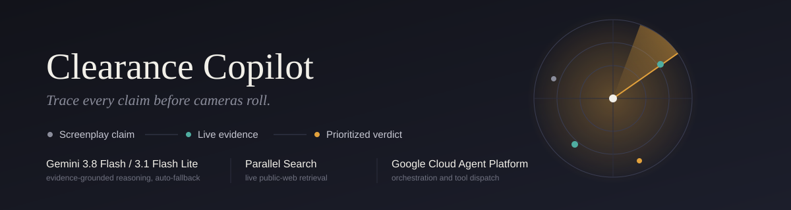
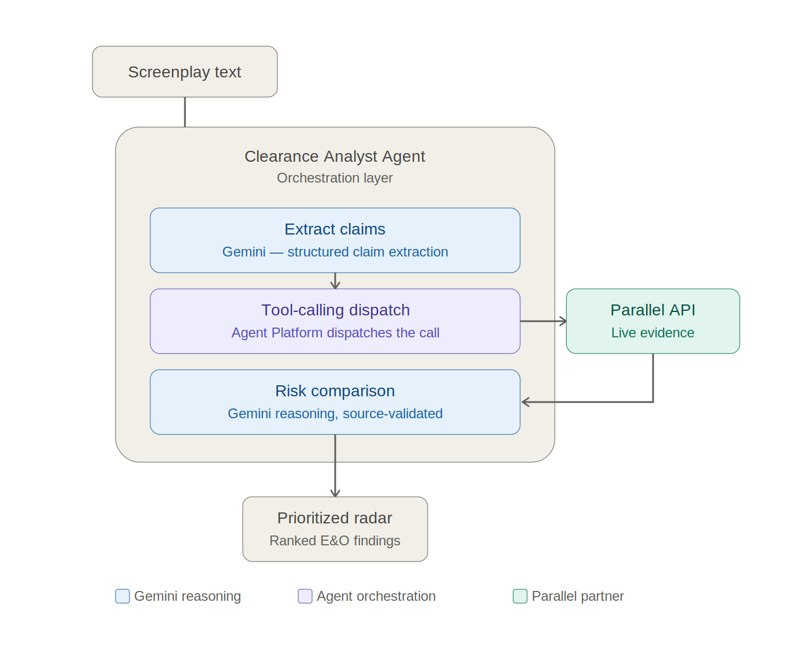

<p align="center">
  
</p>

# Clearance Copilot

**Trace every claim before cameras roll.**

Clearance Copilot is an AI-powered E&O (Errors & Omissions) risk-screening agent for screenplays. It extracts real-world claims from a script, retrieves live public-web evidence through Parallel Search, validates that evidence, and uses Gemini to compare what the screenplay asserts against what the evidence actually supports.

The result is a prioritized clearance radar that helps production teams identify what deserves human clearance review before production.

> Clearance Copilot is a research and risk-screening tool, not legal advice. Final clearance and legal decisions should be made by qualified production or legal professionals.

🔗 **Live app:** [clearance-copilot.ai.studio](https://clearance-copilot.ai.studio/)

Built for **Google Cloud's Agentic Cinema Hackathon** — Parallel Partner Track.

---

## The Problem

A screenplay can contain hundreds of references to real people, organizations, products, locations, events, and factual claims.

The E&O clearance process must determine which of those references could create issues such as:

- Defamatory or potentially misleading factual allegations
- Trademark and product-use concerns
- Music and copyright clearance requirements
- Misattributed or unsupported factual claims
- Real-world organization or public-figure portrayals
- Potentially harmful factual implications

The challenge is not simply finding names in a screenplay. The difficult question is:

> What exactly is the screenplay claiming, what does the public record actually show, and which claims deserve human review?

Clearance Copilot automates that first-pass research workflow.

---

## How It Works

```
SCREENPLAY
    │
    ▼
CLAIM EXTRACTION
    │
    ▼
CLEARANCE ANALYST AGENT
    │
    ▼
PARALLEL SEARCH
    │
    ▼
LIVE PUBLIC EVIDENCE
    │
    ▼
SOURCE VALIDATION
    │
    ▼
GEMINI CROSS-CHECK
    │
    ▼
RISK CLASSIFICATION
    │
    ▼
PRIORITIZED CLEARANCE RADAR
    │
    ▼
HUMAN REVIEW
```

### 1. Claim Extraction

The agent does not treat the screenplay as a single document. It identifies discrete, checkable claims and preserves the surrounding screenplay context.

For example:

> "Musk doctored the Roadster endurance logs in October 2008."

is treated as a specific factual assertion requiring verification — not merely as an occurrence of the entity Elon Musk.

### 2. Live Evidence Retrieval — Parallel Search

For each claim, the Clearance Analyst Agent invokes the official Parallel Search API through the `parallel-web` SDK.

Parallel's role is deliberately narrow and explicit:

> Parallel Search is the live evidence-retrieval layer.

It searches the public web at runtime and returns external sources relevant to the claim, such as:

- Government records
- Regulatory filings
- Court documents
- Official organization records
- Reputable publications
- Copyright/public-record databases
- Other publicly available sources

Parallel does not produce the legal verdict. It supplies the external evidence that the reasoning layer needs. This distinction is fundamental to the architecture:

```
Parallel Search
      │
      │ live external evidence
      ▼
Clearance Analyst Agent
      │
      │ evidence + screenplay claim
      ▼
Gemini
      │
      │ comparative reasoning
      ▼
Risk Assessment
```

This prevents the system from relying solely on model memory when evaluating real-world screenplay claims.

### 3. Source Validation

A retrieved URL is not automatically treated as valid supporting evidence. Clearance Copilot validates that the displayed source actually originated from the Parallel Search response. This creates an evidence-integrity boundary:

```
Parallel returned source
        │
        ▼
   URL validation
        │
        ▼
Evidence relevance check
        │
        ▼
 Only then → Gemini cross-check
```

The system therefore distinguishes between:

- **Source authenticity** — "Was this URL actually returned by Parallel?"
- **Evidence relevance** — "Does this source actually support the screenplay claim?"

This is an important anti-hallucination safeguard. Gemini cannot simply invent a convincing-looking citation and have it appear as verified evidence.

### 4. Evidence-Grounded Cross-Check — Gemini

Gemini receives the screenplay assertion together with the validated evidence. It compares what the screenplay says against what the retrieved evidence actually supports.

The system can surface:

- Supported claims
- Unsupported claims
- Contradictory evidence
- Potentially sensitive allegations
- Trademark/product concerns
- Copyright/licensing concerns
- Real-world portrayal concerns

The model is used for comparative reasoning over retrieved evidence, not as an independent source of legal authority.

### 5. Prioritized Clearance Radar

Claims are classified into four screening categories:

| Classification | Meaning |
|---|---|
| **HIGH-RISK** | Requires urgent human clearance/legal review |
| **CLEARANCE-REVIEW** | Material production or rights concern requiring review |
| **FACTUAL-CONCERN** | Evidence indicates the screenplay assertion may be unsupported or inconsistent |
| **LOW-RISK** | No significant issue surfaced in the available evidence |

Each result includes:

- Screenplay claim
- Claim type
- Supporting evidence
- Evidence quality
- Source URL
- Source validation status
- Gemini comparison
- Risk score
- Clearance-review recommendation

The goal is prioritization, not automated legal approval.

---

## Architecture



Clearance Copilot intentionally separates reasoning/orchestration from external evidence retrieval.

**Google Cloud Agent Platform** — The Clearance Analyst Agent is the orchestration layer. It coordinates claim analysis, tool dispatch, evidence handling, cross-checking, risk comparison, and structured output.

**Parallel Search** — The external evidence layer. It is called independently through its official SDK and retrieves live public-web evidence at runtime. It is not represented as a static knowledge base and it is not treated as the reasoning engine.

**Gemini** — Performs the evidence-grounded comparative reasoning required to determine how the screenplay assertion relates to the retrieved evidence. Configurable via `GEMINI_MODEL`; the live deployment currently runs on **Gemini 3.1 Flash Lite**, with the code also supporting Gemini 3.8 Flash as the primary model and automatic fallback between the two on quota limits.

**Human Review** — The final clearance decision remains with qualified production and legal professionals.

---

## Why Parallel Matters

A conventional LLM-based screenplay analyzer can identify:

> "Elon Musk appears in this script."

That is not enough. Clearance Copilot asks a much more useful question:

> "The screenplay makes this specific assertion about Elon Musk. What does the live public record say about that assertion?"

Parallel provides the fresh external evidence required to answer that question. For example:

```
SCREENPLAY CLAIM
"Musk doctored the Roadster endurance logs..."
                │
                ▼
         Parallel Search
                │
                ▼
         SEC public record
                │
                ▼
       Source validation
                │
                ▼
         Gemini comparison
                │
                ▼
        HIGH-RISK / 92
                │
                ▼
        Human legal review
```

The resulting audit trail connects the screenplay assertion to the actual evidence used to assess it. That evidence chain is the core of Clearance Copilot.

---

## Technology

| Layer | Technology |
|---|---|
| Agent / Orchestration | Google Cloud Agent Platform |
| Agent SDK | `@google-cloud/agentplatform` |
| Reasoning | Gemini via `@google/genai` — configurable model (live deployment: Gemini 3.1 Flash Lite), with automatic fallback support between Gemini 3.8 Flash and Gemini 3.1 Flash Lite on quota limits |
| Evidence Retrieval | Parallel Search via `parallel-web` |
| Backend | Express + TypeScript |
| Frontend | React 19 + Vite + Tailwind CSS |
| Validation | Zod |
| Deployment | Google AI Studio |
| Testing | Automated unit/integration tests |

---

## Project Structure

```
clearance-copilot/
├── src/
│   ├── components/
│   │   ├── ClearanceRadar
│   │   ├── ClaimCard
│   │   ├── ArchitectureModal
│   │   ├── Navbar
│   │   └── LegalDisclaimer
│   │
│   ├── server/
│   │   └── agent/
│   │       ├── clearance-agent
│   │       ├── google-agent-platform
│   │       ├── parallel-tool
│   │       └── source-validator
│   │
│   ├── types/
│   │   └── clearance
│   │
│   ├── data/
│   │   └── demo screenplay
│   │
│   └── tests/
│
├── public/
│   └── assets/
│
├── server.ts
└── .env.example
```

---

## Security & Evidence Integrity

API credentials are server-side environment variables. Required secrets include:

```
GEMINI_API_KEY
PARALLEL_API_KEY
```

Keys are never intended to be:

- hardcoded
- committed to the repository
- exposed to the frontend
- returned through API responses
- displayed in logs

The application also maintains a source-validation boundary so that a model-generated URL cannot automatically become a supposedly verified citation.

---

## Running Locally

```bash
npm install
cp .env.example .env
npm run dev
```

Configure the required environment variables in `.env`:

| Variable | Purpose |
|---|---|
| `GEMINI_API_KEY` | Google Gemini access |
| `PARALLEL_API_KEY` | Parallel Search access |
| `GEMINI_MODEL` | Gemini model identifier. Live deployment currently runs `gemini-3.1-flash-lite`; also supports `gemini-3.8-flash` as primary with automatic fallback on quota errors |
| `APP_URL` | Application URL |

Google Cloud environment variables can be configured when using the corresponding Google Cloud runtime.

---

## Hackathon Track

Clearance Copilot was built for the **Google Cloud Agentic Cinema Hackathon — Parallel Partner Track**.

The project combines **Google Cloud Agent Platform + Gemini** with **Parallel Search** to create an agentic research workflow for media and entertainment.

The partner integration is functional rather than decorative:

> The Clearance Analyst Agent invokes Parallel Search at runtime to retrieve live external evidence for screenplay claims.

The evidence is then passed through source validation and into the Gemini reasoning stage.

---

## What Makes the Approach Different

Clearance Copilot is not simply "upload a screenplay → ask an LLM if it is risky." It creates an evidence chain:

```
SCREENPLAY ASSERTION
        │
        ▼
LIVE PARALLEL SEARCH
        │
        ▼
RETRIEVED PUBLIC RECORD
        │
        ▼
SOURCE VALIDATION
        │
        ▼
EVIDENCE RELEVANCE
        │
        ▼
GEMINI CROSS-CHECK
        │
        ▼
RISK PRIORITIZATION
        │
        ▼
HUMAN CLEARANCE REVIEW
```

The system therefore separates **retrieval → validation → reasoning → prioritization → human decision**, rather than allowing one model response to serve as the entire clearance process.

---

## Status & Scope

Clearance Copilot is a hackathon proof of concept demonstrating an end-to-end first-pass E&O research workflow using live Gemini and Parallel integrations.

It is designed to accelerate and prioritize clearance research, not replace professional clearance specialists or legal counsel. A risk score is a screening signal — not a legal conclusion.

---

## Try It

**Live application:** [https://clearance-copilot.ai.studio/](https://clearance-copilot.ai.studio/)

Load the included demonstration screenplay and run the clearance analysis to see:

**Claims → Parallel live evidence → Source validation → Gemini cross-check → Prioritized risk radar**

---

*Built for Google Cloud's Agentic Cinema Hackathon.*
